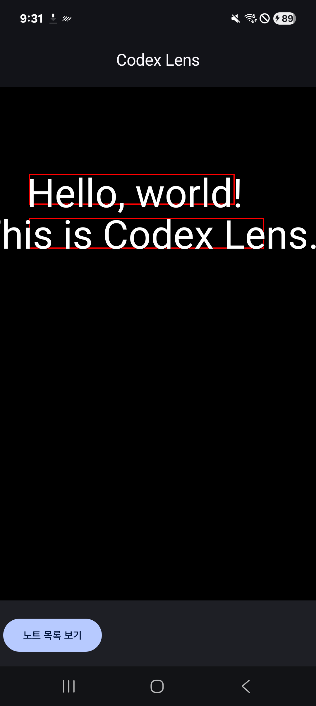
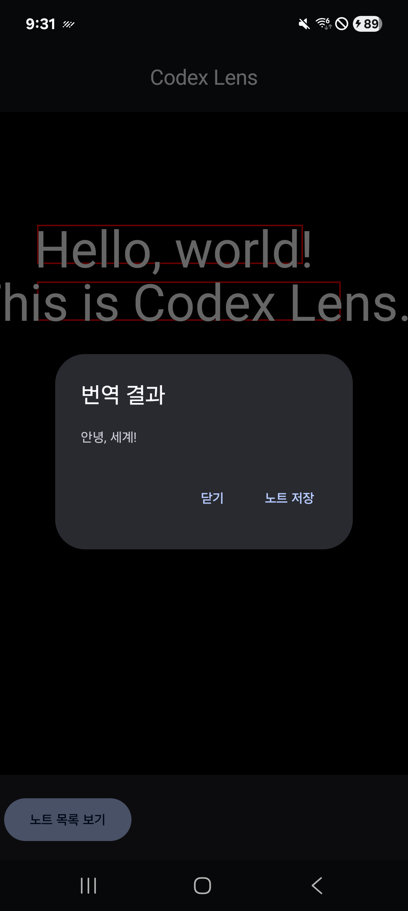
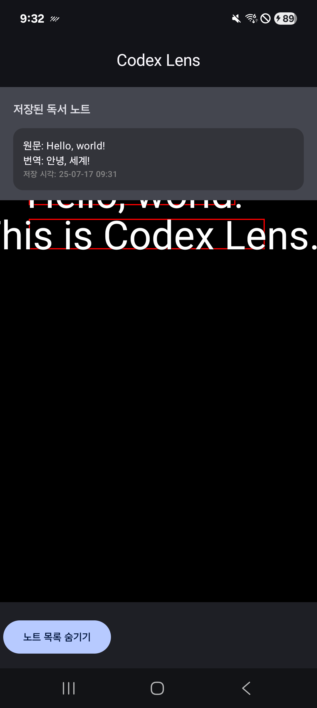

# Codex Lens(MVP, V0.0)

> **AI 기반 실시간 번역 및 독서 노트 저장 모바일 앱**

## 프로젝트 소개

Codex Lens는 카메라로 책/화면을 비추면 실시간으로 텍스트를 인식(OCR)하고,  
터치로 원하는 문장을 선택해 즉시 번역 결과를 확인하거나  
번역/원문을 독서 노트로 저장 & 관리할 수 있는 안드로이드 앱입니다.

**본 프로젝트는 [인텔 인제 양성 교육](https://intel-edu.kr/) 교육에 포함된,  
안드로이드 앱 개발 과정의 최종 개인 프로젝트 결과물입니다.**  

**본 파일/앱 자료는 리뷰를 위해 교육생 및 강사님들께만 공유합니다.
외부 배포·2차 공유·상업적 전환은 자제해 주시고, 문의사항은 개발자에게 말씀해 주세요.**


## 주요 기능

- **실시간 카메라 프리뷰 + OCR**  
  카메라 화면에서 실시간으로 텍스트 블록들을 탐지, 박스로 표시(목업)  
  카메라 화면에서 바운딩박스와 텍스트 인식 결과가 약 0.3~0.5초마다 갱신되는 문제가 있어서,  
  바운딩 박스와 인식된 텍스트를 가상으로 구현하여 기능이 안정화되었을때를 묘사하였습니다.  
    
- **터치 기반 번역 및 오버레이 표시**  
  텍스트 박스 터치 시 번역 요청, 팝업(오버레이)로 번역 결과를 즉시 확인  
    
- **번역/원문 노트 저장 및 목록 조회**  
  '노트 저장' 버튼만 누르면 즉시 DB에 번역/원문이 저장,  
  하단 목록에서 빠르게 확인  
    
- **갤러리 이미지 번역 (확장 예정)**  
  갤러리 이미지에서 텍스트 추출 후 동일한 번역/저장 프로세스 지원

- **노트별 메모/태그 추가 (확장 예정)**  
  추가 설명, 키워드 태그 등 메모 기능(로드맵)

## 기술 스택 및 구조

| 항목      | 사용 기술/라이브러리                  | 설명                                   |
|---------| ------------------------------------- |--------------------------------------|
| 언어/플랫폼  | Kotlin, Android                       | Jetpack Compose 기반 현대적 구현            |
| UI      | Jetpack Compose                       | 단일 메인 스크린 내 OCR, 번역, 저장, 목록 UI 통합    |
| ~~OCR~~ | ML Kit Text Recognition               | ~~실시간 텍스트 탐지~~(목업)                   |
| 번역      | ML Kit Translation                    | 오프라인/온라인 번역 지원                       |
| DB      | Room (SQLite)                         | 노트 정보(원문, 번역, 타임스탬프) 저장              |
| 구조      | MVVM + Repository 패턴                | ViewModel/StateFlow 기반 상태 관리         |
| 이미지/저장  | MediaStore, File API                  | 번역/노트 내보내기, 사용자 파일 접근                |
| 아키텍처    | 단일/통합 MVP(단계적 화면 확장)        | 추후 CaptureScreen, ReadScreen으로 분할 가능 |

## 프로젝트 구조 예시

```
├─ app/
│  ├─ data/
│  │  ├─ model/       # ReadingNote, ReadingNoteDao, AppDatabase
│  ├─ ui/
│  │  ├─ MainScreen.kt  # OCR, 번역, 저장, 리스트 UI
│  ├─ viewmodel/
│  │  ├─ CodexLensViewModel.kt
│  │  ├─ CodexLensViewModelFactory.kt
│  └─ MainActivity.kt
```

## 화면 플로우 및 설계 산출물

- **상태/액티비티 다이어그램 등은 문서 폴더 참조**

### 문서 목록

- [제품 요구사항 정의서(PRD)](docs/PRD.md)
- [기능 명세서(FRS)](docs/FRS.md)
- [아키텍처/기술명세서](docs/ARCHTECTURE.md)
- [사용자 시나리오](docs/UserScenario.md)
- [ERD(엔티티-관계 다이어그램)](docs/ERD.puml)
- [시퀀스 다이어그램](docs/Sequence.puml)
- [상태 다이어그램](docs/State.puml)
- [액티비티 다이어그램](docs/Activity.puml)

## 빌드 및 실행 방법

1. **프로젝트 클론**
   ```bash
   git clone https://github.com/your-org/codex-lens.git
   ```
2. **Android Studio(OX 버전 이상)로 열기**
3. **필수 라이브러리/플러그인 동기화**
4. **실기기(USB 디버깅) 또는 에뮬레이터 실행**
5. **필요 권한(카메라, 저장소) 허용**
6. **카메라를 비추고 번역/저장 기능 테스트**
7. **release_mvp/CodexLens.apk 를 다운로드하여 실행** 
## 개발 및 품질 안내

- 주요 로직, ViewModel, DB, Composable 등은 KDoc으로 문서화
- 예외 처리, 로딩 상태 안내 등 사용자 경험(UX) 반영
- 기능 테스트 시각화(로딩, 성공, 실패 분기) 적용
- 코드/구조 관련 궁금점은 코드 상단 KDoc 참고

## 향후 로드맵 및 확장

- 노트 별 메모/태그/이미지 첨부 지원
- 다중 언어 번역, 사용자 커스텀 모델 등록
- 캡처/읽기 등 다중 Screen 확장, 네비게이션 도입
- 노트 검색/필터, 클라우드 백업 등

## 라이선스

본 프로젝트는 MIT License를 따름
```
MIT License (c) Codex Lens Project Authors
```

## 문의 및 기여

- 이슈 및 피드백은 PR로 환영합니다.
- 프로젝트/기술/코드 구조 등 논의는 docs/README 또는 Discussions 활용

**실제 코드 흐름, 데이터 구조, 화면 다이어그램 세부 내용은 docs/ 폴더 산출물과 프로젝트 구조 설명을 참고하세요.  
궁금한 점이나 추가 문서화 요청이 있다면 언제든 이슈 또는 PR 남겨주시면 됩니다!**
